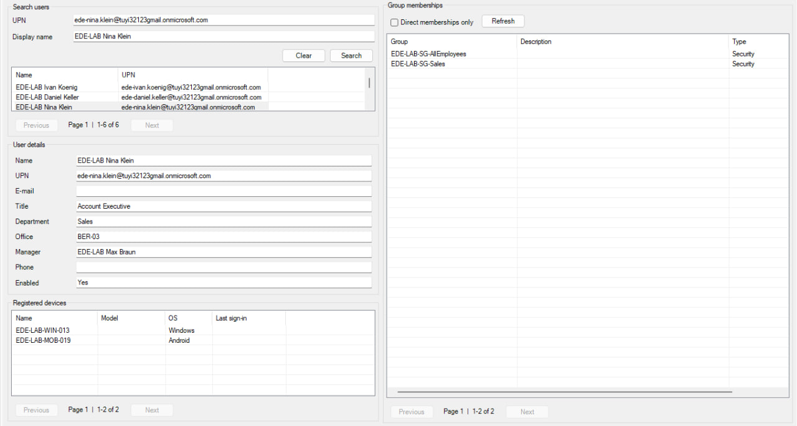
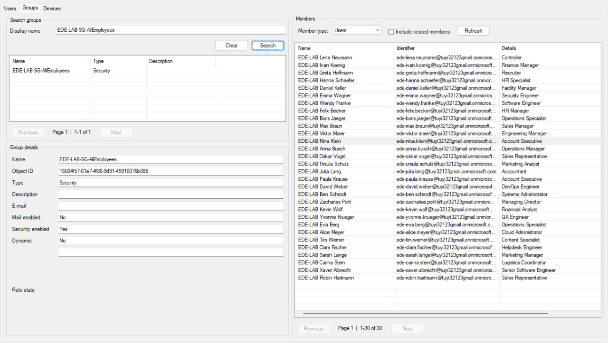
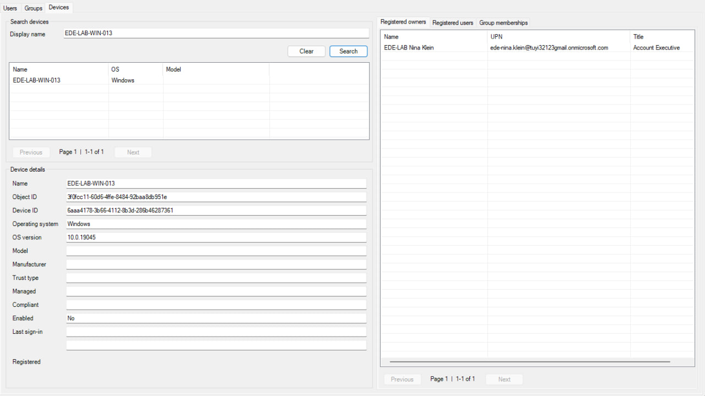

# Entra Directory Explorer

A read-only Windows Forms utility for browsing Microsoft Entra ID users, groups, devices, and their relationships through Microsoft Graph.

The application is designed for quickly exploring directory objects without navigating through multiple Entra admin center pages.



## Features

### Users

- Search users by display name or UPN
- View:
  - display name
  - UPN
  - e-mail
  - job title
  - department
  - office
  - manager
  - business phone
  - account state
- Browse registered devices
- Browse direct and nested group memberships
- Distinguish direct and nested memberships

### Groups

- Search groups by display name
- View:
  - object ID
  - group type
  - description
  - e-mail
  - mail/security state
  - dynamic membership state
- Browse members by type:
  - Users
  - Groups
  - Devices
- Optionally include nested members



### Devices

- Search devices by display name
- View:
  - object ID
  - device ID
  - operating system and version
  - model
  - manufacturer
  - trust type
  - managed/compliant state
  - account state
  - last sign-in
  - registration date
- Browse registered owners
- Browse registered users
- Browse direct and nested group memberships



## Relationship navigation

Directory relationships are navigable directly from the UI.

Double-click an entity in a result or relationship list to open it:

- User → registered device
- User → group
- Group → user
- Group → nested group
- Group → device
- Device → registered owner
- Device → registered user
- Device → group

The application automatically switches to the appropriate tab and loads the selected object's details.

This makes it possible to explore Entra ID as a connected directory rather than as isolated lists of objects.

## Communication deep links

When the corresponding attribute is populated:

- Double-click a user's E-mail field to open the default mail client through a `mailto:` link.
- Double-click a user's Phone field to open the system phone handler through a `tel:` link.

## Paging

Microsoft Graph queries use server-side paging.

The UI provides Previous and Next controls independently for search results and relationship lists so large directories do not have to be loaded into memory at once.

## Requirements

- Windows 10/11
- Windows PowerShell 5.1 or PowerShell 7 on Windows
- `Microsoft.Graph.Authentication` 2.35.0
- An Entra account allowed to consent to or use the following delegated Microsoft Graph scopes:
  - `User.Read.All`
  - `Group.Read.All`
  - `GroupMember.Read.All`
  - `Device.Read.All`

## Start

Open PowerShell in the project directory:

```powershell
.\Install-Dependencies.ps1
.\Start-EntraDirectoryExplorer.cmd
```

If script execution is restricted, the application can be started with a process-scoped execution policy without changing the machine-wide policy:

```powershell
powershell.exe -NoProfile -ExecutionPolicy Bypass -File .\EntraDirectoryExplorer.ps1
```

## Usage

1. Start the application.
2. Select "Connect to Entra ID" and authenticate.
3. Search for a user, group, or device.
4. Double-click a search result to load its details.
5. Follow related users, groups, and devices by double-clicking entries in relationship lists.

Pressing "Enter" in a search field also starts the search.

## Operational notes

- The project is read-only: it does not create, edit, or delete Entra objects.
- Microsoft Graph permissions still depend on tenant policy and the signed-in user's permissions.
- Graph requests are currently performed synchronously. Large pages can briefly block UI repainting, so page sizes are intentionally conservative.
